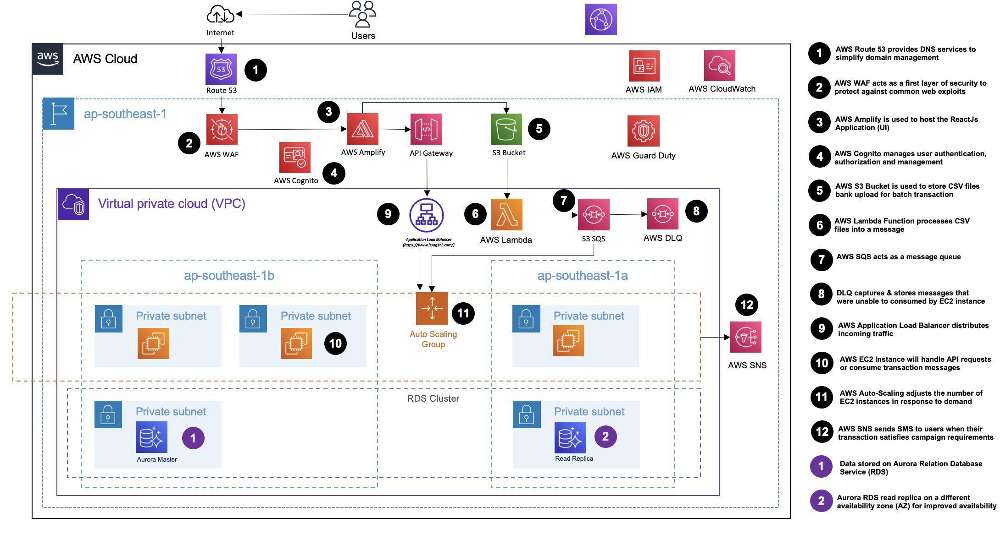
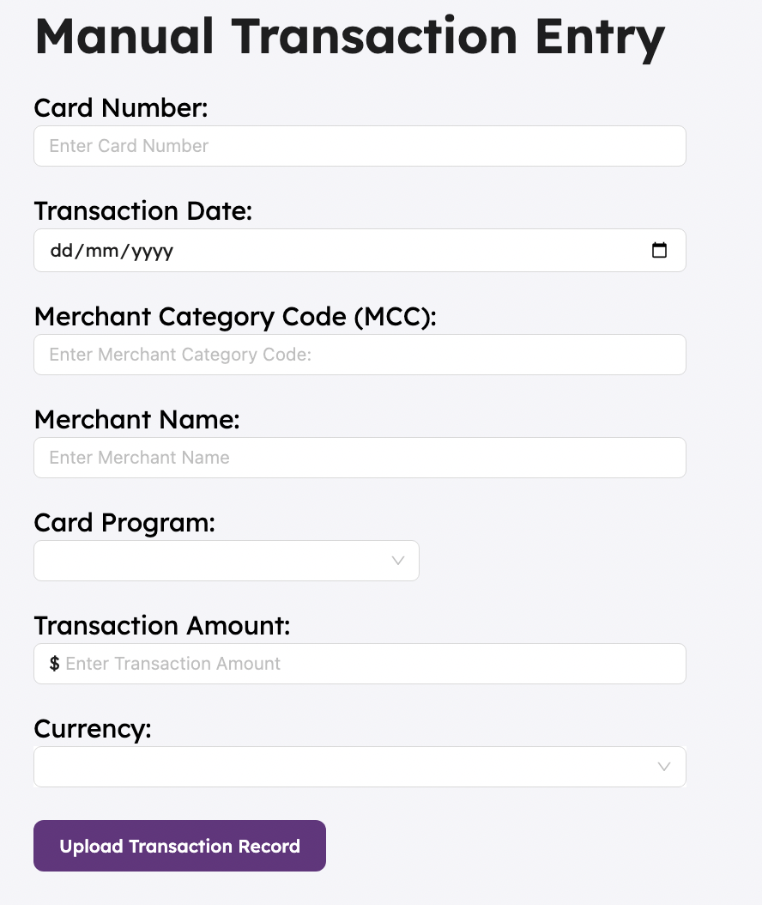
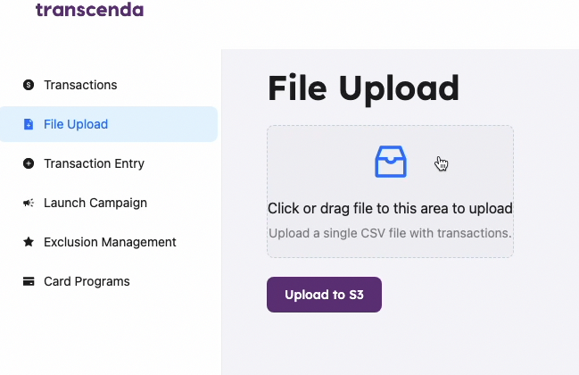
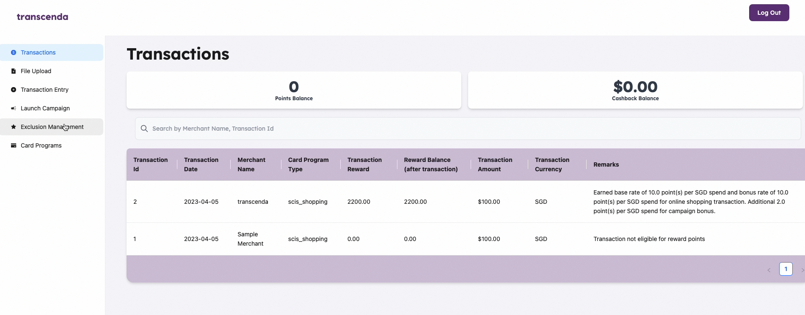
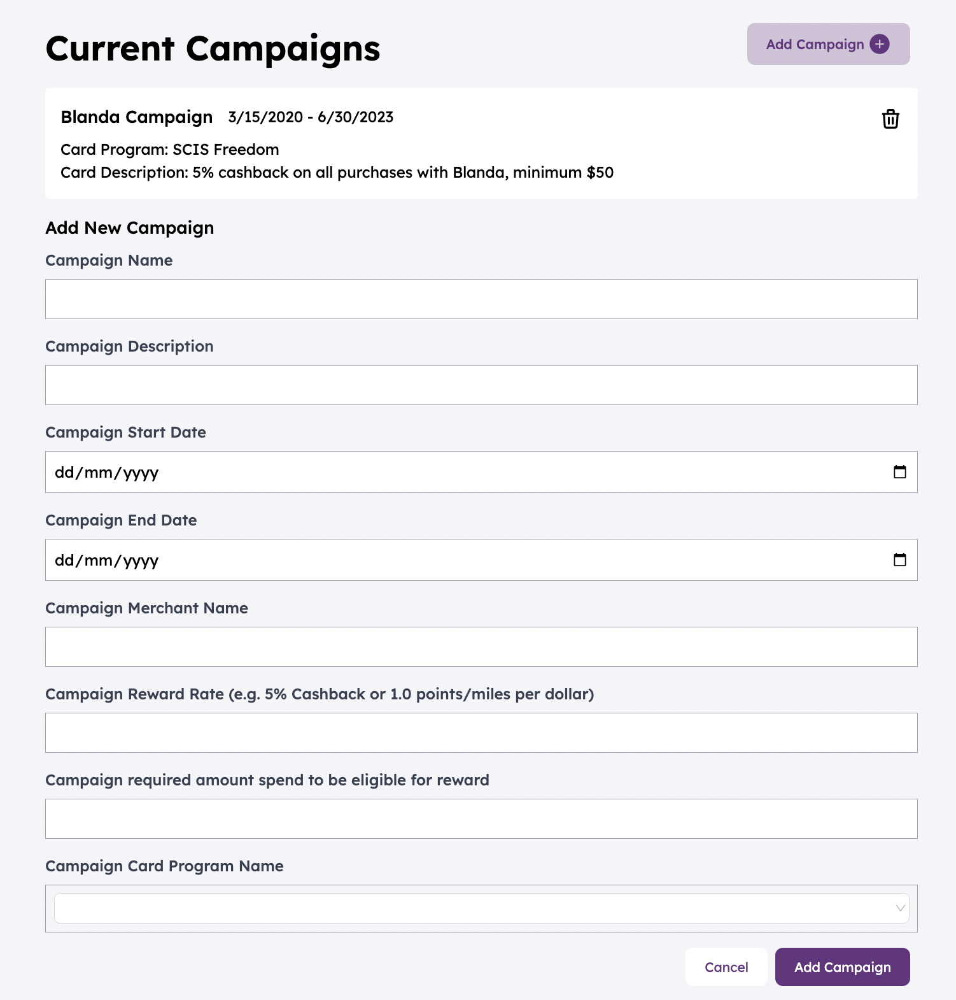
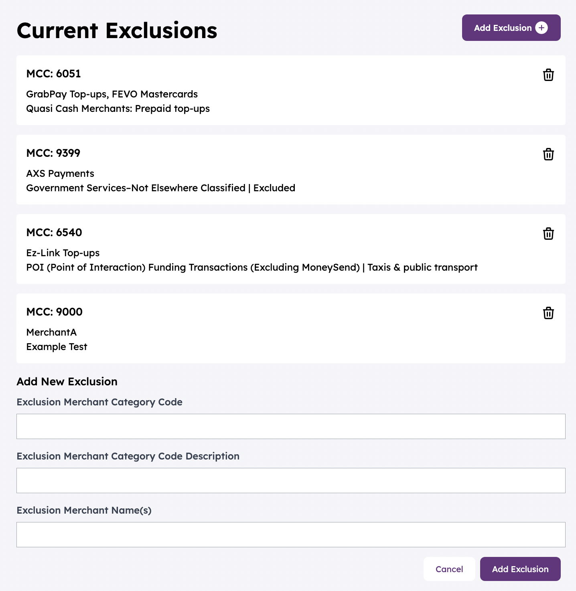

# Transcenda

<div align="center">
    
    <div align="center">
        
         
         
        
    </div>
</div>

> Project By: ITSA G1T1
> - [Zhao Xing](https://github.com/Newbieshine/)
> - [Kaushik](https://github.com/BlackMagicKau)
> - [Yuan Sheng](https://github.com/ChongYuanSheng/)
> - [Novia](http://github.com/noviaantony/)
> - [Ariff](http://github.com/KimmyChanga/)
> - [Ashley](https://github.com/ashsunshine)
> - [Chong Jun](https://github.com/ChongJun123)
> - [Lester](https://github.com/lester0142)

Code submission for [SMU CS301]

***Visit our deplpyed site [here](http://itsag1t1.com)***
***and view our demo video [here](https://youtu.be/IW4LNMVWlCc)***

## Background
> Transcendas manages large-scale spending datasets received daily and showcases the launch of a versatile product designed to handle substantial volumes of transactional data for SCIS Bank. 

### Features
- Processing Transaction Data
  - Banks can upload transaction data in batch via a CSV file or via API end points. Our system is able to accept a file of up to 1 million transaction records and process it within a day.
  - Uploaded CSV files are stored on AWS S3 
  - AWS SQS to hold messages representing transactions
  - Transaction Processing application code deployed on EC2 server instances 
  - Data stored on AWS AuroraRDS Cluster
- Campaign and Merchant Exclusion Management 
  - Banks can launch campaigns with merchants for specific transaction types and card programmes.
- Campaign and Merchant Exclusion Management 
    - Customers can see all their cards and transactions when they log into the web application

## Architecture Diagram


## Transcenda User Interface
### Manual Transaction Entry (API Endpoint)


### Bulk Transaction Processing


### All Transactions


### Add,Delete & View Current Campaigns


### Add,Delete & View MCC Exclusions



## Local development
### Setting up
Clone our repository from GitHub to your `desired_folder_name`

```bash
git clone https://github.com/cs301-itsa/project-2022-23t2-g1-t1.git desired_folder_name
```
### Frontend
```
cd your-own-directory/project-2022-23t2-g1-t1/client
```
Run the following command to install all the React package dependencies:
```
npm install
```
Run the following command to start the React app:
```
npm start
```
your app should be running on `localhost:3000`


### Backend

Launch your IDE

Run the following command to install all the Spring package dependencies:
```
mvn install
```
or if you are on intellij, you can just import the maven project by locating the pom.xml file in the transcenda folder 
right-click on the pom.xml file and select "add as maven project"

Make the necessary changes to the application.yml file in the transcenda/src/main/resources folder as shown below
```
Application.yml
   
    DataSource:
        url: jdbc:postgresql://localhost:5432/transcendas
        username: <your-own-postgres-username>
        password: <your-own-postgres-password>
   
   cloud:
        aws:
            region:
                static: <your-AWS-Region>
                auto: false
            credentials:
                access-key: <your-AWS-ACCESS-key> 
                secret-key: <your-AWS-SECRET-key> 
            end-point:
                uri: <your-AWS_SQS_ENDPOINT>

sns:
    topic: <your-AWS_SNS_TOPIC_ARN>

INIT_VECTOR_SPRING: <INIT_VECTOR> //this is for AES encryption
AES_SECRET_KEY_SPRING: <AES_SECRET_KEY> //this is for AES encryption must be in 128 bits
    
```
Note: you will need to install postgresql on your local machine and create a database called transcendas. Additionally,
you will need to create all the AWS services and replace the credentials in the application.yml file with your own credentials

Run the following command to start the Spring app:
```
mvn spring-boot:run
```
or if you are on Intellij, you can  run the TranscendasApplication.java file located in transcenda/src/main/com.project202223g1t1.transcendas/TranscendaApplication.java


## Disclaimer
We do not own or license any copyrights in the images used in the application. We are also not affiliated to the brands mentioned/used in this application. You may use the Services and the contents contained in the Services solely for your own individual, non-commercial and informational use only.
